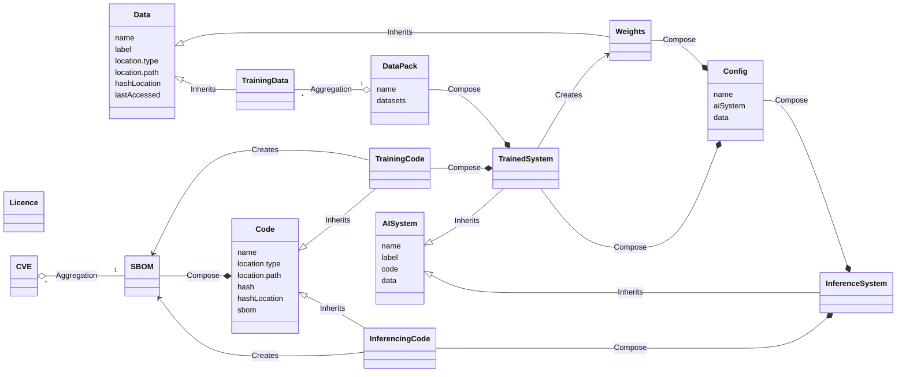

## Class Diagram

## Claims & Attestations

Below are a few examples of claims and attestations which can be made on an AI system

### Data

- **Unwanted Bias**:  
  The presence of biases in the training data that can lead to skewed results or unfair outcomes.

- **Hallucinations**:  
  Instances where the system generates outputs that are factually incorrect or misleading due to inaccuracies in the data.

- **Errors in Generated Data**:  
  Refers to inaccuracies or mistakes in the data produced by the system during its operation or training.

- **Data Poisoning**:  
  The risk that adversarial inputs can corrupt the training dataset, potentially leading to malicious outcomes.

- **Data Pollution**:  
  The introduction of unwanted or low-quality data that degrades the quality and performance of the trained model.

### Systems

- **Cybersecurity Flaws**:  
  Vulnerabilities in the system architecture that could be exploited by malicious actors to compromise security.

- **Implementation Flaws**:  
  Issues arising from incorrect implementation of the system, which can lead to performance problems or security vulnerabilities.

- **Compliance Gaps**:  
  Potential areas where the system may not meet regulatory or industry standards, impacting trust and legal standing.