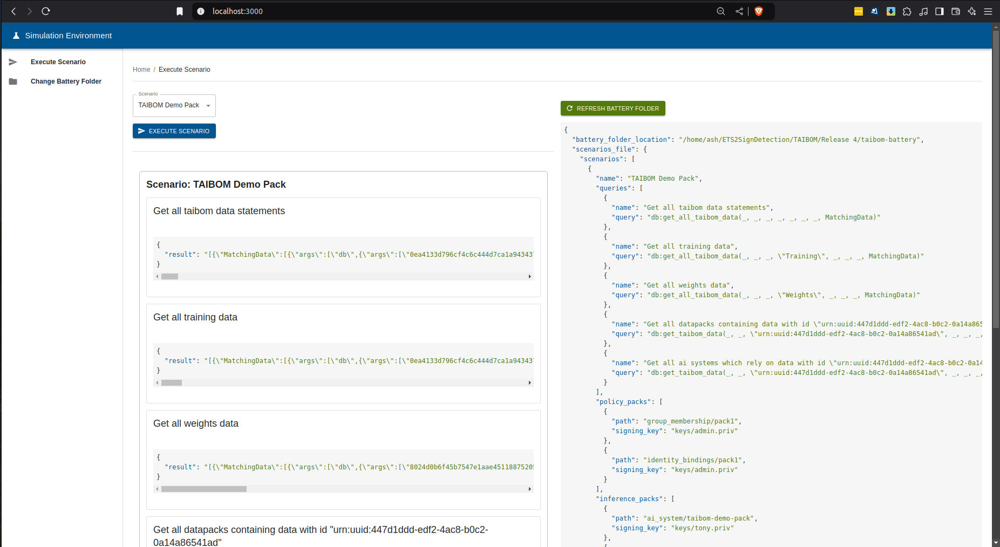

In order to run the taibom-battery you should run [claim cascade](https://github.com/nqminds/ClaimCascade), and then configure the [claim cascade config file in the battery](Release 4/taibom-battery/claim_cascade_config.json) to point to your input directories and root keys path. You may want to run `cargo run --bin anti-bootstrap` to remove any leftover files from previous usage of claim cascade.

You should then run the [simulation environment](https://github.com/nqminds/simulation-environment?tab=readme-ov-file#usage) server and frontend, as described in the readme. You should then use the frontend web app to change battery folder to the taibom-battery, once done successfully you should see the [scenarios file]([scenarios](Release 4/taibom-battery/scenarios.json)) from the battery in the execute scenario screen, you should be able to select the `ETS2SignDetection Release 4` from the scenario drop down and execute it, which should load the VCs specified in the [scenarios file]([scenarios](Release 4/taibom-battery/scenarios.json)) into claim cascade and run the queries defined in the scenario, display the results of the queries in the web frontend. See below for an example screenshot of what this should look like:

