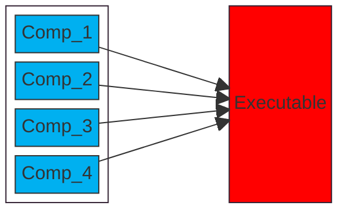

#  TAIBOM Business drivers

In this section we discuss the primary drivers for TAIBOM from a business case perspective

## SBOM definition

AIBOMs are an evolution of SBOMs. It is instructive therefore to understand the intended purpose behind SBOM and its business case, in order to inform the AIBOM discussion. 

A Gemini AI summary provides the following useful definition 

> A Software Bill of Materials (SBOM) is a list of all the components that make up a software program. 
>
> It includes information about the licenses, versions, and patch status of each component.
>
> What's in an SBOM?
>
> - **Components**: 
>
>   A list of all the components, including open-source libraries, proprietary software, and licensed dependencies
>
> - **Licenses**: 
>
>   The licenses that govern each component
>
> - **Versions**: 
>
>   The versions of each component used in the code
>
> - **Patch status**: 
>
>   The patch status of each component
>
> - **Provenance information**: 
>
>   Other information about the components, such as the tools used to produce them
>
> Why are SBOMs important?
>
> - SBOMs help organizations understand their software supply chains and identify risks.
> - They help organizations track known and new vulnerabilities.
> - They help organizations ensure that only authorized dependencies are included in software projects.
> - They help organizations make better security decisions.
>
> How have SBOMs been used?
>
> - The [National Telecommunications and Information Administration (.gov)](https://www.ntia.gov/page/software-bill-materials) (NTIA) has been involved in developing SBOMs through a multistakeholder process.
> - The White House (.gov) issued an executive order in 2021 that made SBOMs mandatory for federal IT systems. 

CISA Landing page https://www.cisa.gov/sbom

Fundamentally SBOMs provide a useful tool to help manage risks

They do so by providing a system description, which is of sufficient detail to help map and propagate risks, across complex software systems

And important clarification on the limits of SBOM 

- the system description and the dependencies are of sufficient level of complexity to track risks
- the system description does not provide sufficient level to build the system (that is a different level )
- SBOM does not provide bit exact descriptions , but system dependencies

The typical risks that are annotated and mapped are

* CVE - vulnerability risk
* licensing based risk 

## SBOM business case

SBOM can practically deliver on the following business cases 

| **Risk type**        | **Use case**                                                 |
| -------------------- | ------------------------------------------------------------ |
| **Security  risk**   | **What security risks is my system exposed to?** Does my system have any critical vulnerabilities? A new critical CVE is announced in component X - which of my systems are impacted? |
| **Export risk**      | **What export risks or foreign control risk is my system exposed to?** Does my inventory contain any Foreign Ownership, Control, or Influence (FOCI) issues? |
| **Licensing risk**   | **What commercial licensing risks is my system exposed to ?** Does my inventory contain any licensing risks - e.g. GPL pollution ? |
| **Support risk**     | **What supports obligations is my organisation exposed to ?** Under CRA (or other) regulations, what software support liabilities exist through dependencies on external (open source?) systems |
| **Subrogation risk** | **What are the implications of insurance risk both for suppliers and consumers of my product ?** Under insurance current practices, what liabilities is my organisation exposed to though typical subrogation practices. |

Specifically, SBOM provides a manifest, that describes the material component dependencies.  This manifest can be exchanged at the commercial interface points between two organisations. Each of the risk listed above can be usefully informed by these component descriptions. 

## AI BOM Progression

What is AIBOM in the context of SBOM.

There is an argument they are one and the same thing; AI is just complex software

In standard SBOM, the risks of the target system are primarily determined by the risk in the component systems 

The key distinction being

* in software the bulk of the risk comes from executables and shared libraries which constitute the running code, and a small amount of the risk comes from the configuration settings, or data inputs
* in AI the bulk of the risk comes from the data/configuration settings  (e.g trained weights), while the executable code is both physically smaller, by comparison and updates less regularly

In other words

* behaviour of typical software is driven be functional definition 
* behaviour of AI is driven from dynamic data sets 

Obviously this is a sliding scale, and the boundary is somewhat blurred.

However it is true that typical AI development workflows 

* introduce new flavours of risk
* have a more complex development cycle involving broader stakeholders
* have more distributed stakeholders.

This increased complexity requires new innovation. But many of these innovation can be applied to traditional software also.

Another distinction we find useful to make

* SBOM: To contain, track and manage **software** supply chain risks
* AIBOM: To contain, track and manage **information** supply chain risks

Where information is "data" and manifest in AI systems both in the trained data sets and the trained weights 

## AIBOM Business case 

AIBOM inherits the business case drivers of SBOM with a few minor adjustments:

| **Risk type**                   | **Use case**                                                 | **TAIBOM changes**                                           |
| ------------------------------- | ------------------------------------------------------------ | ------------------------------------------------------------ |
| **Software vulnerability risk** | Does my **Inference** OR **Training** system have any critical vulnerabilities?A new critical CVE is announced in component X - which of my systems are impacted? | Need to consider dependency between training and inference system |
| **Export risk**                 | Does my inventory contain any Foreign Ownership, Control, or Influence (FOCI) issues? | Different export license surrounding AIEU specific regulation restrict use |
| **Licensing risk**              | Does my inventory contain any licensing risks - e.g. GPL pollution ? | See copyright risk later                                     |
| **Support risk**                | Under CSA (or other) regulations, what software support liabilities exist through dependencies on external (open source?) systems | Unexplored what implications CSA has for AI systems          |

But wee can these additional AI focussed risks

| **Risk type**                 | **Use case**                                                 |
| ----------------------------- | ------------------------------------------------------------ |
| **Data poisoning**            | Has my training data been intentionally poisoned - and can I trace impact through to all deployed inference systems |
| **Data pollution**            | Has my training data been accidentally polluted?             |
| **Performance checks**        | Do I have evidence that the system has been validated (performs well enough) for the application |
| **Copyright risk**            | Is there any inherent copyright infringement risk in the data on which the system has been trained |
| **Bias risk**                 | Are there inherent biases in either the data on which the AI system has been trained or in the performance on the versioned inference system |
| **System tampering risk**     | Has the software or the trained weights been tampered with   |
| **Best practice/Legislation** | Do I have evidence that the system designers employed best practice in the development of the system |
| **Supply chain risk**         | Do I trust all the actors involved in the creation of the system. FOCI checks. |