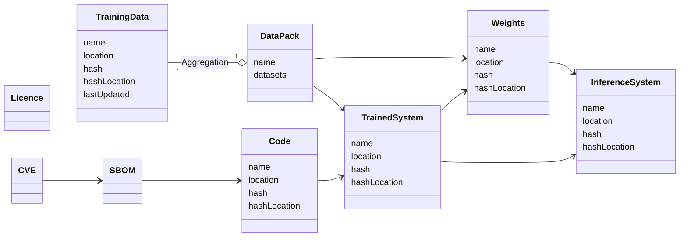

## Class Diagram

## Relationships

`{Data}`  => Data Pack

Data Pack + System => Weights

Weights + System => Inferencing system

## Additional attributes

Data + Licence => Licenced Data

SBOM + system => System component breakdown

CVE + System component breakdown => Security-Audited System 

## Claims & Attestations

### Data

- Unwanted Bias
- Hallucinations 
- Errors in generated data
- Poisoning 
- Pollution
- etc.

### Systems 
- Cybersecurity Flaws
- Implementation flaws
- etc

