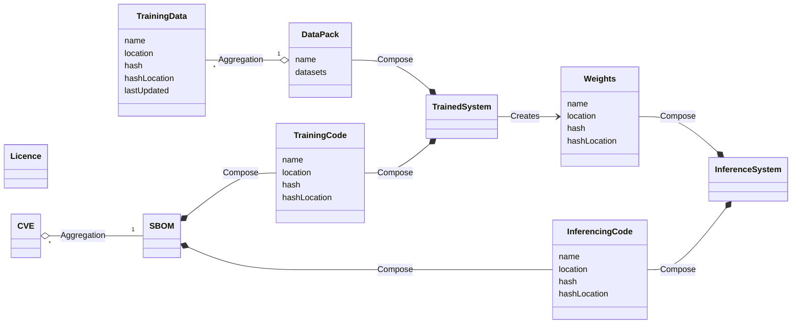

## Class Diagram

## Relationships

### Data Relationships
- **Data to DataPack**:  
  Represents the collection of datasets within a single data package.  
  `TrainingData "*" --o "1" DataPack : Aggregation`

### System Composition
- **DataPack to TrainedSystem**:  
  Indicates that a `TrainedSystem` is composed of a `DataPack`, suggesting that the system is built from the data provided in the pack.  
  `DataPack --* TrainedSystem : Compose`

- **Weights to InferenceSystem**:  
  Indicates that an `InferenceSystem` is composed of `Weights`, suggesting that the system relies on these weights for its inference operations.  
  `Weights --* InferenceSystem : Compose`

- **TrainedSystem creates Weights**:  
  Indicates that the `TrainedSystem` generates or produces weights necessary for the inference process.  
  `TrainedSystem --> Weights : Creates`

### Code Relationships
- **CVE to SBOM**:  
  Indicates that an SBOM aggregates multiple `CVE`s, representing known vulnerabilities associated with the components listed in the SBOM.  
  `CVE "*" o-- "1" SBOM : Aggregation`

- **SBOM to TrainingCode**:  
  Indicates that the SBOM is composed of `TrainingCode`, detailing the software components used during training.  
  `SBOM *-- TrainingCode : Compose`

- **TrainingCode to TrainedSystem**:  
  Indicates that a `TrainedSystem` is composed of `TrainingCode`, showing that the code is integral to the training process.  
  `TrainingCode --* TrainedSystem : Compose`

- **SBOM to InferencingCode**:  
  Indicates that the SBOM is composed of `InferencingCode`, detailing the software components used during inference.  
  `SBOM *-- InferencingCode : Compose`

- **InferencingCode to InferenceSystem**:  
  Indicates that an `InferenceSystem` is composed of `InferencingCode`, showing that this code is essential for the functioning of the inference process.  
  `InferencingCode --* InferenceSystem : Compose`

## Class Descriptions

### DataPack
- **Attributes**:
  - `name`: The name of the data pack.
  - `datasets`: A collection of datasets included in the pack.

### TrainingData
- **Attributes**:
  - `name`: The name of the training data.
  - `location`: The storage location of the training data.
  - `hash`: The hash of the training data for integrity verification.
  - `hashLocation`: The location of the hash for the training data.
  - `lastUpdated`: The timestamp of the last update to the training data.

### Licence
- **Attributes**:  
  (No specific attributes defined)

### CVE
- **Attributes**:  
  (No specific attributes defined)

### SBOM
- **Attributes**:  
  (No specific attributes defined)

### TrainedSystem
- **Attributes**:  
  (No specific attributes defined)

### InferenceSystem
- **Attributes**:  
  (No specific attributes defined)

### Weights
- **Attributes**:
  - `name`: The name of the weights.
  - `location`: The storage location of the weights.
  - `hash`: The hash of the weights for integrity verification.
  - `hashLocation`: The location of the hash for the weights.

### TrainingCode
- **Attributes**:
  - `name`: The name of the training code.
  - `location`: The storage location of the training code.
  - `hash`: The hash of the training code for integrity verification.
  - `hashLocation`: The location of the hash for the training code.

### InferencingCode
- **Attributes**:
  - `name`: The name of the inferencing code.
  - `location`: The storage location of the inferencing code.
  - `hash`: The hash of the inferencing code for integrity verification.
  - `hashLocation`: The location of the hash for the inferencing code.
