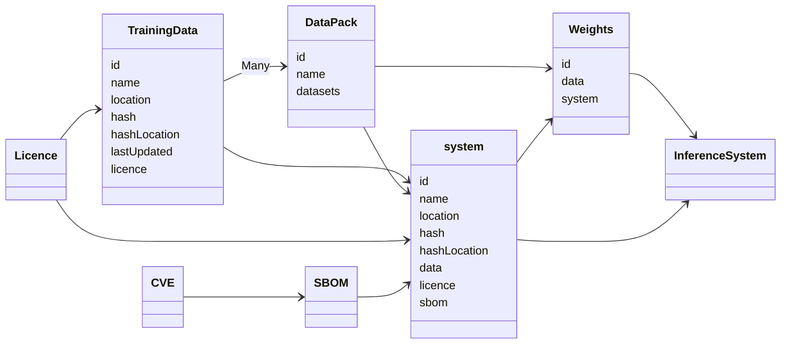

## Class Diagram

## Relationships

`{Data}`  => Data Pack

Data Pack + System => Weights

Weights + Syatem => Inferencing system

## Additional attributes

Data + Licence => Licenced Data

SBOM + system => System component breakdown

CVE + System component breakdown => Security-Audited System 

