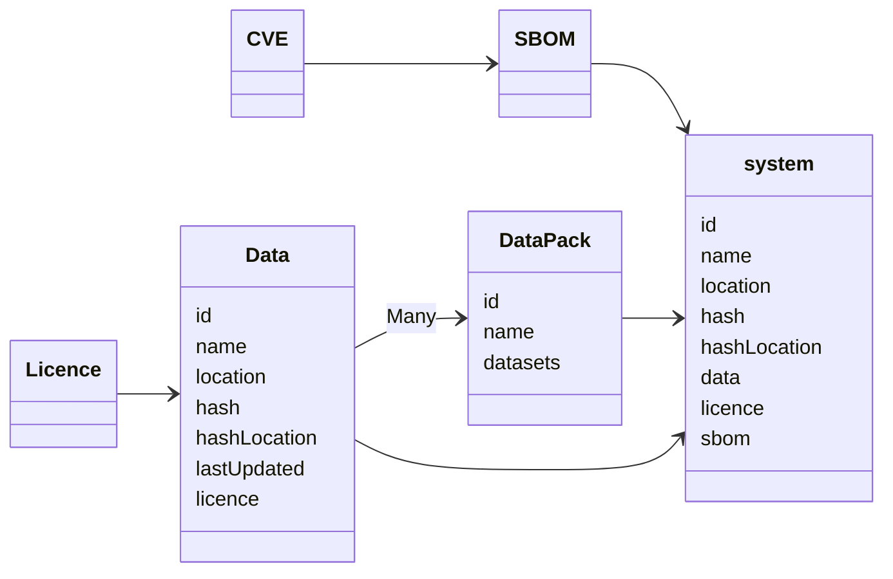

## Class Diagram

```mermaid
classDiagram 
    direction LR

    class DataPack {
        id
        name
        datasets
    }

    class Data{
        id
        name
        location
        hash
        hashLocation
        lastUpdated
        licence
    }

    class Licence{
    }
    class CVE{
    }
    class SBOM {
    }
    class system {
        id
        name
        location
        hash
        hashLocation
        data
        licence
        sbom
    }

    Licence --> Data
    Data  -->  DataPack: Many
    CVE --> SBOM
    SBOM --> system
    DataPack --> system
    Data --> system
```