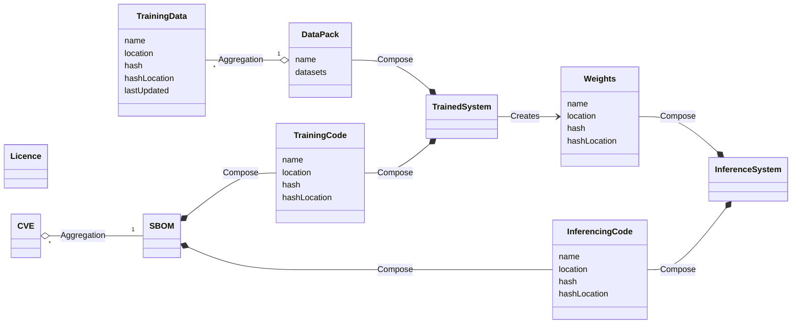

## Class Diagram

## Relationships

### Data Relationships
- **Data to DataPack**:  
  Represents the collection of datasets within a single data package.
  
### TrainedSystem Composition
- **DataPack to TrainedSystem**:  
  A `TrainedSystem` is composed of a:
  - DataPack
  - TrainingCode

- **TrainedSystem creates Weights**:  
  The `TrainedSystem` generates or produces weights necessary for the inference process.

### InferenceSystem Composition
- **Weights to TrainedSystem**:  
  An `InferenceSystem` is composed of:
  - Weights
  - InferencingCode

### Code Relationships
- **CVE to SBOM**:  
  Indicates that an SBOM aggregates multiple `CVE`s, representing known vulnerabilities associated with the components listed in the SBOM.

- **SBOM to Code**:  
  Indicates that the SBOM is composed from `Code`, detailing the software components used. 

## Claims & Attestations

### Data

- **Unwanted Bias**:  
  The presence of biases in the training data that can lead to skewed results or unfair outcomes.

- **Hallucinations**:  
  Instances where the system generates outputs that are factually incorrect or misleading due to inaccuracies in the data.

- **Errors in Generated Data**:  
  Refers to inaccuracies or mistakes in the data produced by the system during its operation or training.

- **Data Poisoning**:  
  The risk that adversarial inputs can corrupt the training dataset, potentially leading to malicious outcomes.

- **Data Pollution**:  
  The introduction of unwanted or low-quality data that degrades the quality and performance of the trained model.

### Systems

- **Cybersecurity Flaws**:  
  Vulnerabilities in the system architecture that could be exploited by malicious actors to compromise security.

- **Implementation Flaws**:  
  Issues arising from incorrect implementation of the system, which can lead to performance problems or security vulnerabilities.

- **Compliance Gaps**:  
  Potential areas where the system may not meet regulatory or industry standards, impacting trust and legal standing.