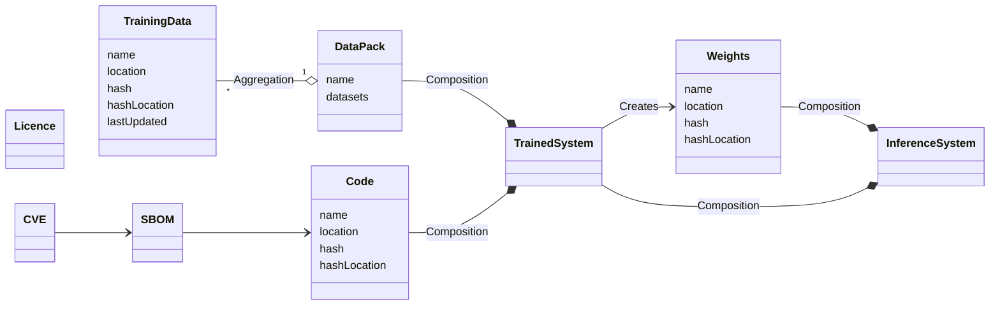

## Class Diagram

## Relationships

- **Data to DataPack**:  
  Represents the collection of datasets within a single data package.
  
- **DataPack to TrainedSystem**:  
  Indicates that a `DataPack` is composed of a `TrainedSystem`, suggesting a strong ownership relationship where the system is built from the data pack.

- **Weights to InferenceSystem**:  
  Indicates that `Weights` are composed within an `InferenceSystem`, suggesting that the inference system relies on the specified weights for its operation.

- **TrainedSystem to Weights**:  
  Represents the creation of `Weights` by the `TrainedSystem`, indicating that the system generates or updates the weights based on its training process.

- **SBOM to TrainingCode**:  
  Indicates that the Software Bill of Materials (SBOM) includes components and dependencies related to the `TrainingCode`.

- **TrainingCode to TrainedSystem**:  
  Represents the composition relationship where `TrainingCode` is an integral part of the `TrainedSystem`.

- **SBOM to InferencingCode**:  
  Indicates that the SBOM includes components and dependencies related to the `InferencingCode`.

- **InferencingCode to InferenceSystem**:  
  Represents the composition relationship where `InferencingCode` is an integral part of the `InferenceSystem`.

## Additional Attributes

- **Data and Licence**:  
  Represents the licensing status of the data, indicating that the data is legally protected and compliant with specified licensing terms.

- **SBOM and TrainedSystem**:  
  Represents the breakdown of components within a trained system, detailing the software materials and dependencies that make up the system.

- **CVE and SBOM**:  
  Indicates the identification of vulnerabilities associated with the components listed in the SBOM, highlighting security concerns in the system’s architecture.

## Claims & Attestations

### Data

- **Unwanted Bias**:  
  The presence of biases in the training data that can lead to skewed results or unfair outcomes.

- **Hallucinations**:  
  Instances where the system generates outputs that are factually incorrect or misleading due to inaccuracies in the data.

- **Errors in Generated Data**:  
  Refers to inaccuracies or mistakes in the data produced by the system during its operation or training.

- **Data Poisoning**:  
  The risk that adversarial inputs can corrupt the training dataset, potentially leading to malicious outcomes.

- **Data Pollution**:  
  The introduction of unwanted or low-quality data that degrades the quality and performance of the trained model.

### Systems

- **Cybersecurity Flaws**:  
  Vulnerabilities in the system architecture that could be exploited by malicious actors to compromise security.

- **Implementation Flaws**:  
  Issues arising from incorrect implementation of the system, which can lead to performance problems or security vulnerabilities.

- **Compliance Gaps**:  
  Potential areas where the system may not meet regulatory or industry standards, impacting trust and legal standing.
