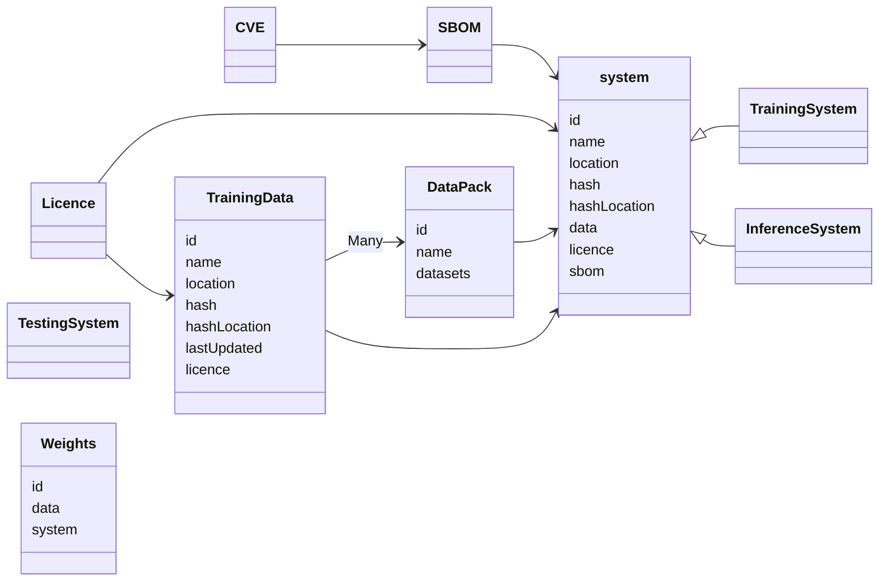

## Class Diagram

```mermaid
classDiagram 
    direction LR

    class DataPack {
        id
        name
        datasets
    }

    class TrainingData{
        id
        name
        location
        hash
        hashLocation
        lastUpdated
        licence
    }

    class Licence{
    }

    class CVE{
    }

    class SBOM {
    }

    class system {
        id
        name
        location
        hash
        hashLocation
        data
        licence
        sbom
    }

    class TrainingSystem{
    }

    class TestingSystem{
    }

    class InferenceSystem{
    }
    
    class Weights{
        id
        data
        system
    }

    CVE --> SBOM
    SBOM --> system
    Licence --> system
    Licence --> TrainingData
    TrainingData  -->  DataPack: Many
    DataPack --> system
    TrainingData --> system


    %% Inheritance to represent types of system
    system <|-- TrainingSystem
    system <|-- InferenceSystem
```

## Relationships

Data + System => Weights

