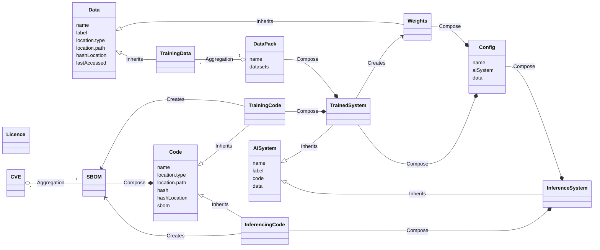

## Verifiable Credential Schema 

TAIBOM is built on verifiable credentials

The scope of version 1 is summarised on the diagram below, which identifies the key elements and the relationship between each  

