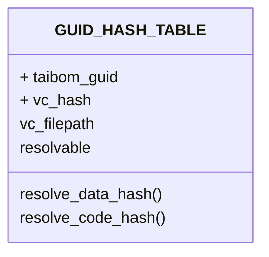
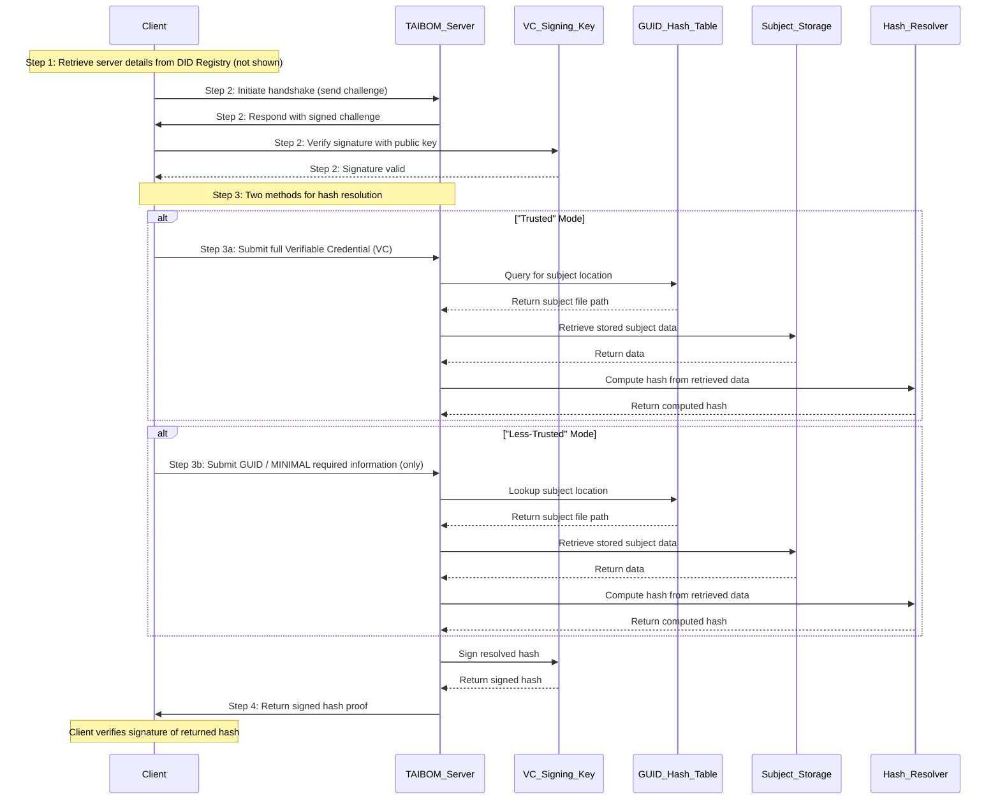

# TAIBOM SDK Architecture

### Conventions: 
- TAIBOMS ALWAYS use relative paths or PUBLIC (and resolvable) uris
    - Although the paths will resolve, where this breaks is if the data / code / system is moved, we then lose "sight" of where the TAIBOM is referencing the subject.
    - Schemas will need updating to add this rule
- TAIBOMS MUST have a folder in the parent directory of the system
    - Therefore if the subject is moved, the taiboms should move with them, and hence the relative paths should resolve
```
    - /SYSTEM_OR_DB/
        - /TAIBOMS/
            - TAIBOM_GUID_1
            - TAIBOM_GUID_2
        - file_1
        - /dir_1/
            - sub_file_1
```
- TAIBOMS which calculate hashes (i.e. Data, Code) SHOULD include directory metadata, but only provide a warning if the metadata does not resolve
    - A metadata hash should be calculated for nested directories
    - A metadata schema can be appended to the VC to give human-readable context about the parent directory / target file
- The TAIBOM SDK MUST register the key / email pair with a TAIBOM specific DID registry 
    - NquiringMinds will host a DID registry for identities to be registered to
    - Any DID registry can be created and used if you do not wish to explicitly trust the NquirirngMinds TAIBOM did registry
    - There is scope to extend this DID registry to provide a public address to a [TAIBOM SDK API endpoint](#SDK-API)

## SDK API
The TAIBOM SDK API should provide an API endpoint for resolving hashes created by a TAIBOM Identity.

### Proposed Architecture

#### GUID, HASH table



This database serves as a hash resolution mechanism for TAIBOM, ensuring that hashes linked to specific GUIDs can be looked up efficiently.

- taibom_guid acts as a unique identifier for an entity in the system.
- vc_hash is the hash value derived from a Verifiable Credential (VC).
- vc_filepath stores a reference to the physical Verifiable Credential (VC).
- resolvable indicates whether the stored hash can be resolved or not. A file-watcher agent can be used to determine if the directory has been moved / deleted - and potentially attempt to resolve this, it can also be used if the VC has become detatched from the component it is referencing.
- resolve_data_hash() and resolve_code_hash() provide methods to verify or retrieve information linked to the stored hash, these functions are likely to be identical - so consider a single method resolve_taibom_hash()

#### Resolving data 

