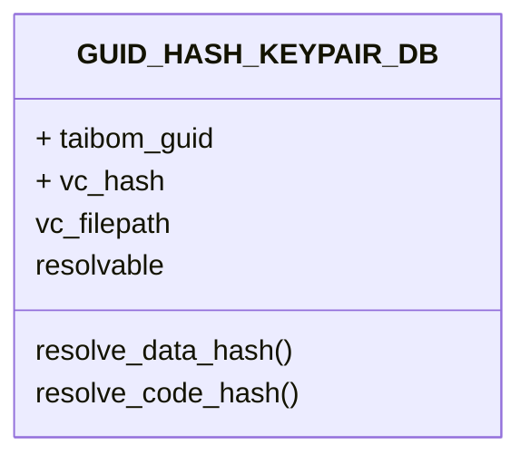

# TAIBOM SDK Architecture

## SDK API Endpoint




### Conventions: 
- TAIBOMS ALWAYS use relative paths
    - Although the paths will resolve, where this breaks is if the data / code / system is moved, we then lose "sight" of where the TAIBOM is referencing the subject.
- TAIBOMS MUST have a folder in the parent directory of the system
    - Therefore if the subject is moved, the taiboms should move with them, and hence the relative paths should resolve
```
    - /SYSTEM_OR_DB/
        - /TAIBOMS/
            - TAIBOM_GUID_1
            - TAIBOM_GUID_2
        - file_1
        - /dir_1/
            - sub_file_1
```