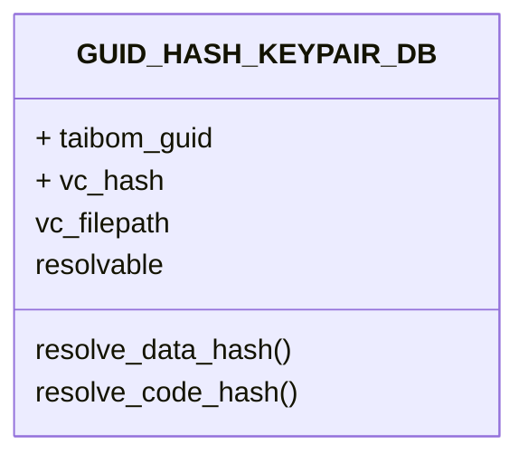

# TAIBOM SDK Architecture

## SDK API Endpoint

```mermaid
classDiagram
    class GUID_HASH_KEYPAIR_DB{
      + taibom_guid
      + vc_hash
      vc_filepath
      resolvable
      resolve_data_hash()
      resolve_code_hash()
    }
```

### Conventions: 
- TAIBOMS ALWAYS use relative paths
    - Alt