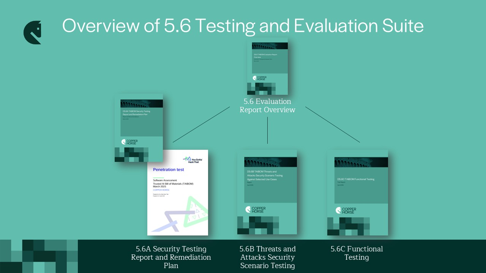

This page provides the reports from the TAIBOM Testing and Evaluation work deliverable at the end of March 2025. These reports are provided for transparency purposes. It is important to note that the system full-stack security testing against the test implementation was performed in order to aid future developments. The vulnerabilities identified should not be read as fundamental insecurity in this TAIBOM implementation as it is essentially a prototype for exploration of the art of the possible as part of the research work.

 

The reports cover independent penetration testing of the TAIBOM code base (doc D5.6A), plus various security scenario (adversarial) testing against the AI models Copper Horse created with and without TAIBOMs applied (doc 5.6B). There are high-level industry recommendations which will be explored further in the future (doc D5.7).

 

<ul>
  <li>
    D5.6 TAIBOM Evaluation Report Overview — 
    <a href='/D5.6-TAIBOM-ERO.pdf'>Download PDF</a>
  </li>
  <li>
    D5.6A TAIBOM Security Testing Report and Remediation Plan — 
    <a href='/D5.6A-TAIBOM-STR.pdf'>Download PDF</a>
  </li>
  <li>
    D5.6B TAIBOM Threats and Attacks Security Scenario Testing Against Selected Use Cases — 
    <a href='/D5.6B-TAIBOM-TASS.pdf'>Download PDF</a>
  </li>
  <li>
    D5.6C TAIBOM Functional Testing — 
    <a href='/D5.6C-TAIBOM-FT.pdf'>Download PDF</a>
  </li>
  <li>
    D5.7 TAIBOM Industry Recommendations — 
    <a href='/pdfs/D57-TAIBOM-IR.pdf'>Download PDF</a>
  </li>
</ul>
